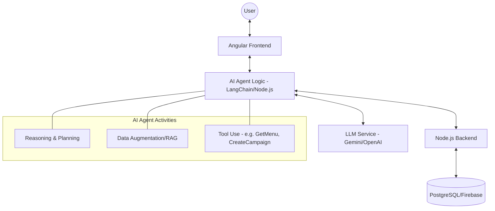

# AI Agent Integration Planning Document

## 1. Project Overview

### Website Topic and Purpose
**CampusCafe** is a comprehensive campus dining management system designed to streamline the food ordering process for both students/faculty and cafe owners. The primary purpose is to reduce wait times during peak hours, optimize café operations, and provide a seamless digital ordering experience within a campus environment.

### Target Users
*   **Students & Faculty:** Busy individuals looking for quick meal options between classes/meetings.
*   **Cafe Owners/Staff:** Users who need to manage orders efficiently, track inventory, and understand sales trends.

### Core Features
*   **Menu Management:** Real-time updates of available products and categories.
*   **Order System:** Digital ordering with status tracking.
*   **User Authentication:** Secure login for customers and administrators.
*   **Campaigns & Loyalty:** Promotions and point-based reward systems to encourage retention.
*   **Dashboard:** Analytical overview for shop owners to manage daily operations.

---

## 2. AI Agent Concept

### What problem will the AI agent solve?
The transition from a standard e-commerce site to an "Agentic" system aims to solve **indecision** and **operational inefficiency**.
Users often struggle with budget constraints or choosing what to eat, while owners manually track trends without predictive insights.

### Type of Agent
We plan to implement a **Multi-Agent System** acting as:
1.  **Campus Dining Personal Assistant (Customer Side):** A proactive recommender that understands user preferences and constraints.
2.  **Operational Strategy Advisor (Owner Side):** An evaluator and predictor that assists in business decision-making.

### User Interaction
*   **Chat Interface:** A floating assistant for customers to ask for recommendations (e.g., "What can I eat for 150 TL that isn't heavy?").
*   **Smart Forms/Widgets:** Contextual suggestions during the checkout process (e.g., "You usually order coffee at this time, add it to your pre-order?").
*   **Background Automation:** An autonomous agent for owners that monitors inventory and automatically drafts "Flash Sale" campaigns for surplus products.

---

## 3. System Architecture (High-Level)

The AI Agent will be integrated as a separate layer that communicates with both the Frontend and the Backend.

### Interaction Flow
1.  **Frontend (Angular):** Captures user intent through chat or UI events and sends it to the AI Gateway.
2.  **Backend (Node.js/Express):** Provides the AI Agent with real-time data context (current menu items, inventory levels, user order history).
3.  **AI Service (External API):** Uses LLMs (OpenAI/Gemini) to process context and generate reasoning-based actions or responses.

### High-Level Architecture Diagram

---

## 4. Proposed Agentic Features

### I. Smart Budget & Health Assistant
*   **Role:** Recommender/Advisor.
*   **Logic:** Analyzes the menu based on the user's price limit and dietary preferences. It doesn't just list items; it "thinks" about the best value combo.

### II. Predictive Pre-Order Agent
*   **Role:** Assistant/Predictor.
*   **Logic:** Uses historical data to predict peak hours and sends push notifications to users 15 minutes before they usually get hungry, offering a "skip-the-line" pre-order.

### III. Inventory & Trend Monitor
*   **Role:** Evaluator/Advisor (Owner).
*   **Logic:** Proactively alerts the owner when an ingredient is running low or when a certain product is trending unusually high, suggesting a menu update or price adjustment.

### IV. Automated Campaign Manager
*   **Role:** Autonomous Agent.
*   **Logic:** If the agent detects slow sales for a perishable item (e.g., daily sandwiches), it autonomously creates a "Flash Sale" campaign and notifies relevant user segments.
